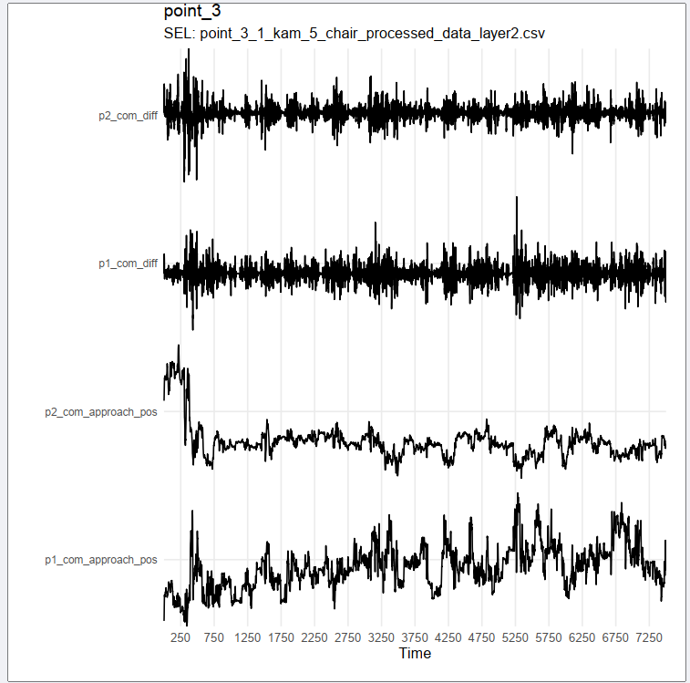
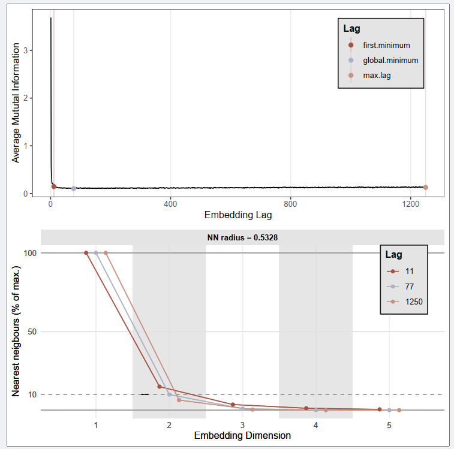
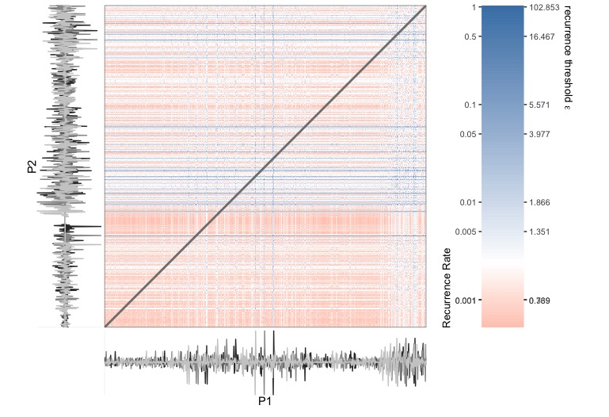
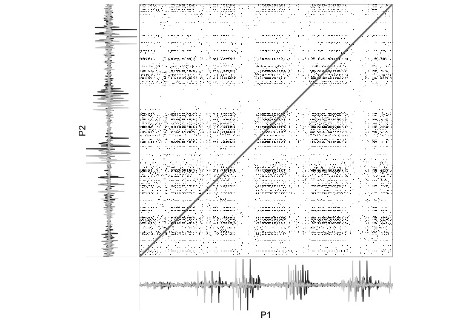
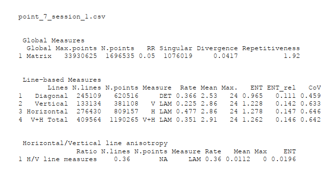

```{r setup, include=FALSE, eval=TRUE}
knitr::opts_chunk$set(
	fig.align = "center",
	fig.height = 7,
	fig.width = 10,
	message = FALSE,
	warning = FALSE,
	collapse = FALSE,
	comment = ">",
	dpi = 72,
	tidy = FALSE,
	width = 800
)

```

```{css, echo=FALSE}
p code {
  font-size: 70%;
}
```
# Authors

**An Open-source Standardized Pipeline for Equitable Observations of Interactive Behavioral Dynamics: Theory-driven Measurement, Analysis, and Archiving**

Arkadiusz Białek^1^, Wim Pouw^2^, ^3^, Travis J. Wiltshire^2^, James Trujillo^4^, Fred Hasselman^5^, Babajide Alamu Owoyele^6^, Natalia Siekiera^1^ & Joanna Rączaszek-Leonardi^7^


1 Institute of Psychology, Jagiellonian University
2 Department of Cognitive Science & Artificial Intelligence, Tilburg University
3 Donders Institute for Brain, Cognition and Behaviour, Radboud University Nijmegen
4 Institute for Logic, Language and Computation, University of Amsterdam
5 Behavioural Science Institute, Radboud University Nijmegen
6 Artificial Intelligence and Intelligent Systems, Hasso Plattner Institute Potsdam
7 Human Interactivity and Language Lab, Faculty of Psychology, University of Warsaw


# Setup

Load some packages and set some variables... change the `path_repo` to the path where you downloaded the Github Repository (https://github.com/WimPouw/InterPerDynPipeline).

```{r load}
# Load packages
library(rio)
library(plyr)
library(tidyverse)
library(casnet) # If you have not installed it: devtools::install_github("FredHasselman/casnet")
library(invctr)
library(fpCompare)
library(gplots)
library(testthat)
library(report)


# Paths to files 
path_repo <- "/Users/fred/GitHub/InterPerDynPipeline"
path_meta <- file.path(path_repo,"meta")
path_oridata <- file.path(path_repo,"dataoutput_STEP1_2_timeseries")
#path_seldata <- file.path(path_repo,"code_STEP3_nonlinear_analysis")
path_results <- file.path(path_repo,"dataoutput_STEP3_nonlinearstatistics")
```


## Prepare data

The code below records the steps taken to create the main data file. 


```{r prepdata, eval=FALSE, include=TRUE}
# Ages
meta_data  <- rio::import(file.path(path_meta,"project_point_metadata_ages_fin.csv"))
# Data ranges to select
meta_times <- rio::import(paste0(path_meta,"project_point_metadata_starttimes_seconds.csv"))

# Select data segments using file metadata_starttimes
meta_times$exclude_start[is.na(meta_times$exclude_start)] <- 0
meta_times$exclude_end[is.na(meta_times$exclude_end)] <- 0
rio::export(meta_times,file.path(path_meta,"project_point_metadata_starttimes_seconds.csv"))
# Get file list
data_files <- list.files(path = path_oridata, pattern = "point_")

# Time series length (s)
tsLength <- 150

# Subjects
subjects   <- meta_data$subject_nr

for(p in subjects){

  this_subject <- data_files[grep(pattern = paste0("(",p,"_)+"), x = data_files)]

  # Plot the data and write to PDF
  pdf(file.path(path_results, paste0(p ,"_selected_data.pdf")), paper = "a4r")

  for(t in seq_along(this_subject)){

    this_occassion <- rio::import(file.path(path_oridata,this_subject[t]))

    # Select cols
    colIDs <- which(colnames(this_occassion)%in%c("time","p1_com_approach_pos","p2_com_approach_pos"))
    data   <- this_occassion |> select(all_of(colIDs))

    plotTS_multi(data[,-1], title = p, subtitle = paste0("ORI: ",this_subject[t]))

    # Snip?
    snipIDs <- meta_times[grep(x = meta_times$VIDEO_ID, pattern = gsub(pattern = "_processed_data_layer2.csv", x = this_subject[t], replacement = "")),4:5]
    if(all(snipIDs %>>% 0)){
      data[data$time %>=% snipIDs$start_exclude&data$time%<=%snipIDs$stop_exclude,2:3] <- NA
    }

    # Select segment
    rowIDs <- meta_times[grep(x =meta_times$VIDEO_ID, pattern = gsub(pattern = "_processed_data_layer2.csv", x = this_subject[t], replacement = "")),2:3]

    if(rowIDs$stop%<<%(rowIDs$start+tsLength)){
      minVal <- min(c(data[rowIDs$start:rowIDs$stop,2],data[rowIDs$start:rowIDs$stop,3]), na.rm = TRUE)
      pad <- (rowIDs$start+tsLength) - rowIDs$stop
      tmp_time <- seq(rowIDs$start, (rowIDs$start+tsLength), by = 0.02)
      tmp_data <- data |> filter(time %>=% rowIDs$start, time %<=% rowIDs$stop)
      tmp_p1_com_approach_pos <- ts_trimfill(x = tmp_time, tmp_data[,2], padding = NA)$y
      tmp_p2_com_approach_pos <- ts_trimfill(x = tmp_time, tmp_data[,3], padding = NA)$y
      data <- data.frame(time = tmp_time,
                         p1_com_approach_pos = tmp_p1_com_approach_pos,
                         p2_com_approach_pos = tmp_p2_com_approach_pos)
      rm(tmp_data, tmp_time, tmp_p1_com_approach_pos, tmp_p2_com_approach_pos)
    } else {
      rowIDs$stop <- (rowIDs$start+tsLength)
      data <- data |> filter(time %>=% rowIDs$start, time %<=% rowIDs$stop)
    }

    data$p1_com_diff <- c(0,diff(data$p1_com_approach_pos))
    data$p2_com_diff <- c(0,diff(data$p2_com_approach_pos))

    plotTS_multi(data[,-1], title = p, subtitle = paste0("SEL: ",this_subject[t]))
    
    occ <-  strsplit(x = this_subject[t], split = "_")[[1]][3]

    rio::export(data,file = file.path(path_results,paste0(p ,"_","session_",occ,".csv")))
  }
  dev.off()
}
```


An example of output:




# CRQA   

## Estimate Embedding Parameters 

Parameters were estimated using lagged Mutual Information and False Nearest Neighbour analysis.


```{r estparam, eval=FALSE, include=TRUE}
# Estimate parameters ----
data_files <- list.files(path = path_results, pattern = "csv")

for(p in subjects){

  this_subject <- data_files[grep(pattern = paste0("(",p,"_)+"), x = data_files)]

  # Write figures to PDF
  pdf(file.path(path_results,paste0(p ,"_parameters.pdf")))

  paramlist_p1 <- paramlist_p2 <- list()

  for(t in seq_along(this_subject)){

    data <- rio::import(file.path(path_results,this_subject[t]))

    paramlist_p1[[t]] <- est_parameters(data$p1_com_diff, maxDim = 5, doPlot = FALSE, silent = TRUE)
    paramlist_p2[[t]] <- est_parameters(data$p2_com_diff, maxDim = 5, doPlot = FALSE, silent = TRUE)

  }

  dev.off()

  saveRDS(object = list(p1 = paramlist_p1, p2 = paramlist_p2), file = file.path(path_results, paste0(p ,"_","parameters.rds")))
}


# After inspection: Using the global.minimum as emLag, all optimal emDim are maximally 3
# Collect the parameter estimates and write to file
param_data <- ldply(subjects, function(p){
  tmpL <- readRDS(file = file.path(path_results,paste0(p ,"_","parameters.rds")))
  names(tmpL$p1) <- paste0("session_", 1:length(tmpL$p1))
  tmp_p1 <- ldply(tmpL$p1, function(d){d$optimData |> filter(emLag.method == "global.minimum",emDim == 3)} |> mutate(subject = "p1"))
  names(tmpL$p2) <- paste0("session_", 1:length(tmpL$p2))
  tmp_p2 <- ldply(tmpL$p2, function(d){d$optimData |> filter(emLag.method == "global.minimum",emDim == 3)} |> mutate(subject = "p2"))
  return(rbind(tmp_p1,tmp_p2))
})

rio::export(param_data,file.path(path_results, "embedding_parameters_all.csv"))
knitr::opts_chunk$set(fig.align = "left")
```


An example of output:




## Cross-RQA 

*CRQA analyses* were conducted using the maximum estimated lag (`838`) and `3` embedding dimensions.    


```{r crqa, eval = FALSE, include = TRUE}
data_files <- list.files(path = path_results, pattern = "csv")
param_data <- rio::import(file.path(path_results, "embedding_parameters_all.csv"))
meta_data  <- rio::import(file.path(path_meta,"project_point_metadata_ages.csv"))
meta_times <- rio::import(file.path(path_meta,"project_point_metadata_starttimes_seconds.csv"))

subjects   <- meta_data$subject_nr

emDim <- 3
emLag_max <- max(param_data$emLag)
emLag_median <- median(param_data$emLag)
diagonalWindow  <- 1500

for(p in subjects){
  
  crqaOut <- diagProfiles <- list()

  this_subject <- data_files[grep(pattern = paste0("(",p,"_)+"), x = data_files)]

  # Write results to PDF
  pdf(file.path(path_results, paste0(p ,"_CRQAresults.pdf")), paper = "a4r")

  for(t in seq_along(this_subject)){
    
    occ <-  strsplit(x = this_subject[t], split = "_|[.]")[[1]][4]
     
    data <- rio::import(file = file.path(path_results, paste0(p ,"_","session_",occ,".csv")))

    # CRQA using massively parallel computing and bit encoding
    crqaOut[[t]] <- rqa_par(y1 = data$p1_com_diff,
                            y2 = data$p2_com_diff,
                            emDim = emDim,
                            emLag = emLag_max,
                            emRad = NA,
                            targetValue = .05,
                            anisotropyHV = TRUE,
                            AUTO = FALSE,
                            silent = FALSE,
                            doPlot = FALSE)

    outTable <- attributes(crqaOut[[t]])$measuresTable
    gplots::textplot(
      testthat::capture_output({
        cat(paste(this_subject[t],"\n\n\n"))
        cat(" Global Measures\n")
        print(format(outTable$`Global Measures`, digits = 3))
        cat(paste("\n\n Line-based Measures\n"))
        print(format(outTable$`Line-based Measures`, digits = 3))
        cat(paste("\n\n Horizontal/Vertical line anisotropy\n"))
        print(format(outTable$`Horizontal/Vertical line anisotropy`, digits = 3))
      }), cex = 0.8
    )
  dev.off()
  saveRDS(object = crqaOut, file = file.path(path_results,paste0("crqa_maxlag_",p,"_",t,"sessions.Rds")))
  rm(crqaOut) #,diagProfiles)
}
```

An example of a Distance matrix:


An example of a Distance matrix thresholded to yield 5% recurrent points:




An example of output:




Collect the results into 1 file.

```{r resultsfile, eval=FALSE, include=TRUE}
# CRQA results file----
meta_times$participant <- as.numeric(laply(strsplit(meta_times$VIDEO_ID,split = "[_]"), function(s) s[2]))
meta_times$session <- as.numeric(laply(strsplit(meta_times$VIDEO_ID,split = "[_]"), function(s) s[3]))

crqa_files <- list.files(path_results, pattern = "crqa_maxlag_") 

# With lag global.minimum, all optimal emDim are 3
crqa_data <- ldply(crqa_files, function(f){
  cat(f,"\n")
  tmp <- readRDS(file = file.path(path_results,f))
  ind <- gregexpr(pattern = "(point_)(\\d)+", text = f)[[1]]
  p   <- substr(f, start = ind, stop = ind+(attr(ind,"match.length")-1))
  s   <- meta_times |> filter(participant == as.numeric(gsub("point_","",x = p))) |> select(session)
  names(tmp) <- paste0(p,"|session_",s$session)
  return(ldply(tmp))
})

# Create some variables we may need for lmer
crqa_data$subject_nr <- laply(strsplit(crqa_data$.id, split = "[|]"), function(s) s[1])
crqa_data$session <- laply(strsplit(crqa_data$.id, split = "[|]"), function(s) s[2])
crqa_data$subject_nr_n <- as.numeric(laply(strsplit(crqa_data$subject_nr, split = "[_]"), function(s) s[2]))
crqa_data$session_n <- as.numeric(laply(strsplit(crqa_data$session, split = "[_]"), function(s) s[2]))

meta_data_long <- meta_data |> 
  select(1:9) |> 
  pivot_longer(cols= 3:9, names_to = "age_label", values_to = "age_days") |> 
  mutate(session_n = rep(1:7,NROW(meta_data)))

crqa_data <- left_join(crqa_data, meta_data_long)

meta_data_long <- meta_data |> 
  select(c(1,2,10:16)) |> 
  pivot_longer(cols= 3:9, names_to = "age_label_mo", values_to = "age_months") |> 
  mutate(session_n = rep(1:7,NROW(meta_data)))

crqa_data <- left_join(crqa_data, meta_data_long)

crqa_data <- crqa_data |> 
  group_by(session) |> 
  mutate(mean_age_mo = mean(age_months, na.rm = TRUE),
         mean_age_days = mean(age_days, na.rm = TRUE),
         N_sessions = n())

crqa_data <- crqa_data |> 
  group_by(subject_nr_f) |> 
  mutate(N_sessions = n())

crqa_data$age_days_cS1 <- crqa_data$age_days - colMeans(meta_data[,3:9], na.rm = TRUE)[1]
crqa_data$age_months_cS1 <- crqa_data$age_months - colMeans(meta_data[,10:16], na.rm = TRUE)[1]
crqa_data$session_n_0 <- crqa_data$session_n - min(crqa_data$session_n)
crqa_data$age_days_0 <- (crqa_data$age_days - min(crqa_data$age_days))/ max(crqa_data$age_days)
crqa_data$session_n_0 <- crqa_data$session_n - min(crqa_data$session_n)
crqa_data$unique_id <- factor(paste0(crqa_data$subject_nr_n,"_",crqa_data$session_n))
crqa_data$gender_f <- factor(crqa_data$gender, levels = c(0,1), labels = c("girls","boys"))
crqa_data$subject_nr_f <- laply(crqa_data$subject_nr_n, function(n){
  ifelse(n<10, paste0("dyad 0",n), paste0("dyad ",n))})

rio::export(crqa_data,file.path(path_results, "crqa_results_all.csv"))

RPt <-rp(y1 = y1, y2 = y2, emDim = emDim, emLag = 10, emRad=NA)
rp_plot(RPt, plotDimensions = TRUE, xlabel = "P1", ylabel = "P2")

```